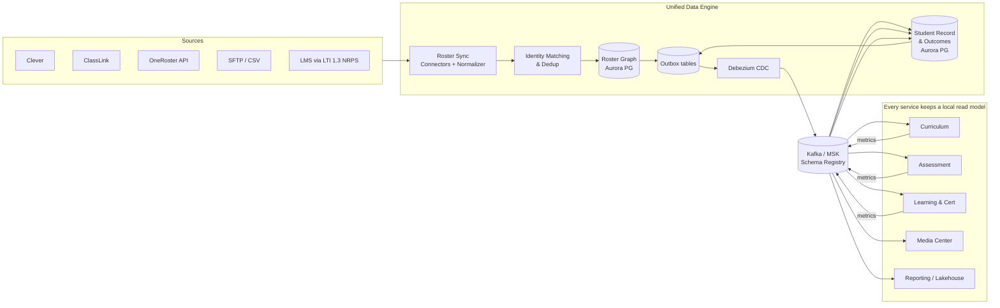

# The Unified Data Engine

**The hardest and most important part of OnePlatform.** This is the substrate that lets
school rosters and student metrics "plug directly into all four services seamlessly."
If this is right, everything else is comparatively easy. If it is wrong, OnePlatform
becomes four apps wearing a trench coat.

---

## 1. The problem, precisely

Four services each need to know:

- **Who** the educators, support staff, and students are.
- **Where** they sit: organization → school → term → course → class → enrollment.
- **What** has happened to each student: assessments, mastered objectives, lessons
  completed, time-on-task, certifications (for adults).

Naively, each service would import its own roster and track its own metrics. That yields
four diverging copies, four CSV uploads per teacher, and reports that never reconcile.

The Unified Data Engine solves this with **two canonical domains** and **one event
backbone**:

1. **Roster Graph** — the single source of truth for identity and structure.
2. **Student Record & Outcomes** — the single source of truth for student metrics.
3. **Event backbone** — propagates both to every service's local read model in near-real
   time.

---

## 2. Canonical data model (OneRoster-aligned)

We adopt the **1EdTech OneRoster** data model as our canonical roster schema. It is the
*lingua franca* of K-12 rostering — Clever, ClassLink, and district SIS exports all map to
it — so adopting it minimizes translation and maximizes interoperability.

### Core roster entities

```
Org (district/school)
 └── AcademicSession (school year / term / grading period)
 └── Course
      └── Class  (a section of a course, at a school, in a term)
           └── Enrollment  (User ↔ Class, role = teacher | student | aide | admin)
 └── User  (teacher | student | admin | aide | guardian)
```

| Entity | Key fields (illustrative) | Notes |
| --- | --- | --- |
| `Org` | `sourcedId`, `tenantId`, `type` (district/school), `parentId` | Hierarchy of districts → schools |
| `AcademicSession` | `sourcedId`, `type` (schoolYear/term/gradingPeriod), `startDate`, `endDate` | Drives "current roster" |
| `Course` | `sourcedId`, `title`, `subject`, `grades[]` | Curriculum maps onto this |
| `Class` | `sourcedId`, `courseId`, `orgId` (school), `termIds[]` | The unit teachers work in |
| `Enrollment` | `sourcedId`, `userId`, `classId`, `role`, `primary`, `beginDate`, `endDate` | The join that powers "my classes / my students" |
| `User` | `sourcedId`, `tenantId`, `role[]`, `givenName`, `familyName`, `identifiers[]`, `email` | Federated identity links here |

> **Identifiers, not just IDs.** Each `User` carries multiple external `identifiers`
> (SIS ID, state ID, Clever ID, ClassLink ID, email). This is what makes **identity
> matching & dedup** possible across sources (Section 4).

### Student Record & Outcomes (canonical metrics)

The Student Record service holds a **minimized** student profile plus a unified,
append-only **metric event store**. Every pillar writes metrics in one shape:

```jsonc
// student.metric.v1  (canonical outcome event)
{
  "metricId": "uuid",
  "tenantId": "org-123",
  "studentSourcedId": "stu-789",
  "source": "SOLER",                 // SOLER | LINKS | SOLS | MEDIA
  "context": {                       // where it happened (roster-linked)
    "classId": "cls-456",
    "courseId": "crs-22",
    "objectiveId": "obj-...",        // links to curriculum scope & sequence
    "lessonId": "les-..."
  },
  "metricType": "objective_mastered",// trial_score | objective_mastered |
                                     // lesson_completed | assessment_scored |
                                     // course_completed | certification_earned ...
  "value": { "masteryLevel": 1.0, "trials": 10, "correct": 9 },
  "occurredAt": "2026-06-08T14:03:00Z",
  "recordedBy": "user-...",
  "schemaVersion": 1
}
```

Because every metric is **roster-linked** (student + class + objective) and **typed**,
any service — and the reporting lakehouse — can answer "how is this student/class/school
progressing?" without bespoke integrations.

---

## 3. Architecture of the engine



### 3.1 Roster Sync (ingestion)

- **Connectors** for Clever, ClassLink, OneRoster REST, SFTP/CSV, and LTI 1.3 NRPS. Each
  connector's only job is to pull source data and emit it in our **canonical OneRoster
  shape** — all source-specific quirks die here behind an **anti-corruption layer**.
- **Scheduling & deltas:** nightly full reconcile + intraday delta sync where the source
  supports it (Clever/ClassLink events). Sync is **idempotent** and **resumable**.
- **Source precedence:** when a tenant has multiple sources, a configured precedence rule
  decides who wins per field (e.g., SIS wins for legal name; Clever wins for class
  membership).

### 3.2 Identity matching & dedup (the subtle part)

The same human can appear with different IDs across sources and years. The matcher:

1. Looks for an exact match on any known **identifier** (state ID, SIS ID, email).
2. Falls back to deterministic + probabilistic matching (name + DOB + school) with a
   confidence score.
3. Above a threshold → auto-merge into the existing canonical `User`; below → queue for
   **human review** in an admin console (never silently mis-merge a child's record).

This produces **one stable canonical `sourcedId` per person** that all services use forever,
even as upstream IDs churn.

### 3.3 Roster Graph (system of record for structure)

- Stores the canonical OneRoster entities with `tenantId` + RLS.
- Exposes a **read API** (gRPC) for fresh queries ("give me the enrollments for class X")
  and **publishes events** for every change via the outbox.
- "Current roster" is a function of the active `AcademicSession` — the graph answers
  *as-of* queries so historical reports stay correct across school years.

### 3.4 Student Record & Outcomes (system of record for metrics)

- Holds the minimized student profile and the **append-only metric store**
  (time-partitioned in Aurora for operational reads; mirrored to the Iceberg lakehouse for
  analytics).
- **Consumes** `student.metric.v1` events from every pillar and **publishes** derived
  rollups (e.g., `objective.progress.updated`) that pillars and dashboards subscribe to.

### 3.5 Event backbone (the connective tissue)

- **Kafka (MSK)** with a **Schema Registry**; all events are versioned Avro/Protobuf with
  enforced backward compatibility.
- **Transactional outbox + Debezium CDC** guarantees that a DB commit and its event are
  never out of sync (no dual-write bug).
- **Topic design** (illustrative):
  - `roster.org.v1`, `roster.class.v1`, `roster.enrollment.v1`, `roster.user.v1`
  - `student.record.v1`, `student.metric.v1`, `student.progress.v1`
  - Each topic keyed by `tenantId` + entity id for ordering and partitioning.
- **Consumers are idempotent** and maintain **local read models** (CQRS): Curriculum keeps
  its own copy of "classes & enrollments I care about," so its hot path never blocks on the
  Roster Graph.

---

## 4. How each pillar plugs in

| Pillar | Reads from engine | Writes to engine |
| --- | --- | --- |
| **Curriculum (Links)** | Classes, enrollments, students, current term; student progress to adapt instruction | `lesson_completed`, `objective_introduced` metrics |
| **Assessment (SOLER)** | Students per class, curriculum objectives to assess against | `trial_score`, `objective_mastered`, `assessment_scored`, evaluation/report-ready events |
| **Learning & Cert (SOLS)** | Educator identities & org roles (adult learners) | `course_completed`, `certification_earned`, CEU metrics |
| **Media Center** | Identity & entitlements; class/role for recommendations | `media_viewed`, `media_completed` engagement metrics |

The **first end-to-end proof** (roadmap Phase 2) is the teacher loop:
*roster syncs → teacher sees their class in Curriculum and Assessment → records data in
SOLER → metric flows to Student Record → Curriculum adapts and Reporting shows it* — all
without a second roster import. When that loop works on the event backbone with local read
models, the data engine is validated.

---

## 5. Consistency, ordering & failure handling

- **Eventual consistency is the contract.** Read models may lag the source by seconds; UIs
  show freshness where it matters and never assume a metric is instantly global.
- **Ordering:** per-entity ordering via Kafka keys; consumers tolerate out-of-order with
  versioned upserts (`lastWriteWins` on `occurredAt`/version).
- **Idempotency:** every event carries a stable id; consumers dedupe.
- **Poison messages** go to per-consumer **dead-letter topics** with alerting and a replay
  tool; no single bad record stalls a partition.
- **Reconciliation jobs** periodically diff each read model against the source of truth and
  emit drift metrics — roster correctness is monitored, not assumed.
- **Backfill/replay:** because the store is event-sourced at the edges, a new service can
  **replay history** to build its read model from scratch.

---

## 6. Analytics & reporting path

- Operational reads (a teacher's dashboard) come from service-local read models — fast,
  scoped, no cross-service joins at request time.
- Cross-cutting analytics (district-wide progress, cohort comparisons, SOLER reports) flow
  through **Kafka → S3 (Iceberg) → dbt models → Athena/Redshift**, surfaced by the
  Reporting service. This keeps heavy analytical queries off transactional databases.

---

## 7. Anti-patterns we explicitly avoid

| Anti-pattern | Why it's fatal here | What we do instead |
| --- | --- | --- |
| Shared roster database all services query | Recreates a distributed monolith; one schema change breaks everyone | Canonical service + events + local read models |
| Each pillar imports its own roster CSV | Diverging copies, re-rostering burden on teachers | Sync once into the canonical graph |
| Synchronous call to Roster Graph on every request | Latency + cascading failure | Local read models updated by events; sync only for fresh reads |
| Dual-write (commit DB *and* publish event in app code) | Lost events / phantom events | Transactional outbox + Debezium CDC |
| Bespoke per-source roster schema | N×M integration mess | Normalize everything to OneRoster at the connector |
| Silent identity auto-merge | Mis-attributing a child's records — a safety & compliance failure | Confidence-scored matching with human review queue |

---

## 8. Key decisions captured as ADRs

- [ADR-0002 — OneRoster as the canonical roster model](../adr/0002-oneroster-canonical-model.md)
- [ADR-0003 — Event backbone with transactional outbox](../adr/0003-event-backbone-outbox.md)
- [ADR-0004 — Database-per-service with CQRS read models](../adr/0004-db-per-service-cqrs.md)
