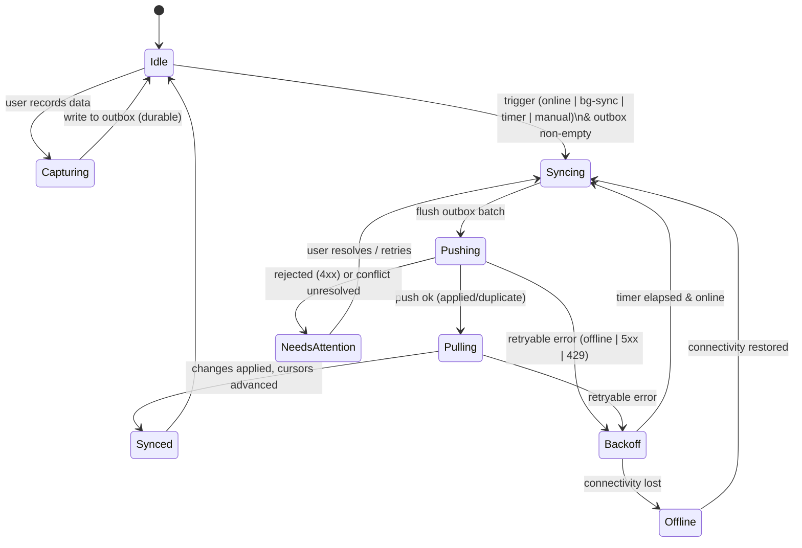

# Offline Sync Protocol

**Status:** Design v1 · **Scope:** the on-device sync engine behind OnePlatform's
offline-first data collection (SOLER on iPads). Builds on
[`04-client-and-mobile-strategy.md`](04-client-and-mobile-strategy.md) and reuses the
platform's event-sourced design at the edge (mirrors the server transactional outbox,
[ADR-0003](../adr/0003-event-backbone-outbox.md)).

This document specifies the **data shapes**, **cursors**, and the **retry/backoff state
machine** in enough detail to implement.

---

## 1. Principles (recap)

1. **Capture never blocks on the network.** A write is durable locally the instant the
   teacher records it; sync happens in the background.
2. **Exactly-once effect.** Every mutation carries a client-generated `opId` that the server
   dedupes on, so retries are safe.
3. **Append-only where possible.** Outcome metrics are appends → conflicts are rare by
   construction. Editable entities use optimistic concurrency.
4. **The client is in compliance scope.** Minimal PII cached, encrypted at rest, purged on
   sign-out/revocation (blueprint §5.3).

Two independent flows:
- **Push** — local mutations → server (the on-device outbox).
- **Pull** — server changes (roster, curriculum) → local read models (delta sync via cursor).

---

## 2. On-device storage (IndexedDB)

Object stores:

| Store | Key | Purpose |
| --- | --- | --- |
| `outbox` | `opId` | pending/inflight mutations awaiting push |
| `reference` | `collection:id` | cached read-model rows (roster, curriculum slice) |
| `cursors` | `collection` | last pull high-water mark per collection |
| `meta` | `key` | deviceId, auth state, schema version, last sync times |

### 2.1 Outbox record

```jsonc
{
  "opId": "0f9c1c8e-7b1a-4a1e-9b2a-3d5e6f7a8b9c", // client UUIDv4 — the idempotency key
  "collection": "metricEvent",                    // metricEvent | sessionNote | goalProgress
  "op": "create",                                 // create | update
  "schemaVersion": 1,
  "payload": {                                    // canonical shape (e.g. student.metric.v1)
    "tenantId": "star-demo",
    "studentId": "sp-S00001",
    "goalId": "G00001",
    "classId": "class-T0026-comm",
    "source": "SOLER",
    "metricType": "TRIAL_SCORE",
    "value": { "trials": 10, "correct": 9, "promptLevel": 2 },
    "occurredAt": "2026-06-08T14:03:00.000Z",
    "recordedById": "T0026"
  },
  "baseVersion": null,            // for `update`: the version the edit was based on
  "occurredAt": "2026-06-08T14:03:00.000Z", // device clock at capture
  "enqueuedAt": "2026-06-08T14:03:00.120Z",
  "attempts": 0,
  "nextAttemptAt": null,          // set while in BACKOFF
  "status": "pending"             // pending | inflight | synced | needs_attention
}
```

`opId` maps directly to the server's `MetricEvent.idempotencyKey`, so the on-device outbox
and the server outbox share one idempotency identity end-to-end.

---

## 3. Push: `POST /api/sync/mutations`

Batched, ordered, idempotent. Headers: `x-tenant-id`, `Authorization: Bearer …`,
`x-schema-version`.

**Request**

```jsonc
{
  "deviceId": "ipad-7a3f…",
  "clientTime": "2026-06-08T14:05:10.000Z",
  "mutations": [
    { "opId": "0f9c…", "collection": "metricEvent", "op": "create", "schemaVersion": 1, "payload": { /* … */ }, "occurredAt": "2026-06-08T14:03:00.000Z" },
    { "opId": "1a2b…", "collection": "sessionNote", "op": "update", "schemaVersion": 1, "baseVersion": 4, "payload": { /* … */ }, "occurredAt": "2026-06-08T14:04:10.000Z" }
  ]
}
```

**Response** — one result per `opId`, same order not assumed (match on `opId`):

```jsonc
{
  "serverTime": "2026-06-08T14:05:10.420Z",
  "results": [
    { "opId": "0f9c…", "status": "applied",   "serverId": "me-G00001-trial-…", "version": 1 },
    { "opId": "1a2b…", "status": "conflict",  "current": { "version": 6, "value": { /* server state */ } } }
  ]
}
```

**Result statuses**

| status | meaning | client action |
| --- | --- | --- |
| `applied` | persisted now | mark `synced`, drop from outbox |
| `duplicate` | `opId` already applied | treat as success, drop |
| `conflict` | `baseVersion` stale (updates only) | resolve (§6), re-enqueue or surface |
| `rejected` | permanent validation failure (4xx-class) | move to `needs_attention`, surface |

Partial success is normal: each op is independent; only `conflict`/`rejected` ops stay in the
outbox. `applied` and `duplicate` are both terminal-success.

---

## 4. Pull: `GET /api/sync/changes`

Delta sync of server-owned read models the device needs offline (roster, curriculum).

```
GET /api/sync/changes?collections=roster,curriculum&cursor=<opaque>&limit=500
```

**Response**

```jsonc
{
  "serverTime": "2026-06-08T14:05:11.000Z",
  "changes": {
    "roster":     [ { "id": "S00001", "op": "upsert", "row": { /* … */ }, "version": 12 },
                    { "id": "S01099", "op": "delete" } ],          // tombstone
    "curriculum": [ { "id": "obj-LINKS-COMM-001", "op": "upsert", "row": { /* … */ }, "version": 3 } ]
  },
  "nextCursor": "eyJzZXEiOjkwMjF9",
  "hasMore": false
}
```

- **Upserts and tombstones** — deletes are explicit `op:"delete"` so the client prunes its
  cache (a row vanishing from a page must not be inferred).
- **Pagination** — when `hasMore` is true the client immediately re-requests with
  `nextCursor` until drained.

---

## 5. Cursors

A cursor is an **opaque, server-defined** token; clients store and echo it, never parse it.

- **Encoding:** `base64url(JSON)` of a per-tenant monotonic change sequence, e.g.
  `{ "seq": 9021 }`. Backed by a monotonic `changeSeq` column (or CDC offset) on each
  read-model so ordering is total and stable.
- **Fallback ordering** where no sequence exists: `(updatedAt, id)` tuple — the `id`
  tiebreaks rows sharing a timestamp so paging can't skip or repeat.
- **Per-collection:** one cursor per collection in the `cursors` store; a single request may
  carry multiple via a compound token.
- **Initial sync:** no cursor → server returns the first snapshot page with a cursor; the
  client pages to completion, then switches to incremental.
- **Idempotent & resumable:** re-pulling from a cursor returns the same or newer changes
  only; a crashed pull simply restarts from the last committed cursor.

> Cursors are monotonic high-water marks, **not** offsets into a fixed list — rows changing
> after a pull reappear with a higher `seq`, which is correct.

---

## 6. Conflict resolution

| Data | Strategy |
| --- | --- |
| Outcome metrics (append-only) | No conflict possible; `opId` dedupe handles re-sends |
| Editable entities (e.g. session note) | Optimistic concurrency on `baseVersion`; server returns `conflict` + `current` |

On `conflict` the client default is **last-write-wins by `occurredAt`**, but for
clinician-authored text it **surfaces a non-destructive merge prompt** ("updated elsewhere")
rather than silently overwriting. Resolved edits re-enqueue with the new `baseVersion`.

---

## 7. Sync engine state machine



**Triggers into `Syncing`:** connectivity regained (`online` event), a Service Worker
**Background Sync** `sync` event (tag `op-flush`), a periodic timer (e.g. 60s while app
foreground), and manual "sync now". Capture itself does **not** force an immediate network
call — it only enqueues and (best-effort) registers a Background Sync.

### 7.1 Retryable vs fatal

| Class | Examples | Handling |
| --- | --- | --- |
| Retryable | offline, DNS, 500/502/503/504, 429 | backoff + retry |
| Auth | 401 | pause queue → refresh token → resume; if refresh fails → re-auth |
| Fatal | 400/409-validation, schema rejected | `needs_attention`, stop retrying that op |

### 7.2 Backoff

- **Exponential with full jitter:** `delay = min(maxDelay, base * 2^attempt)` then
  `actual = random(0, delay)`. Defaults: `base = 1s`, `maxDelay = 5m`.
- **Honor `Retry-After`** on 429/503 (overrides computed delay).
- **Circuit breaker:** after `N` consecutive failed batches (e.g. 6) enter `Offline` and wait
  for an `online` event instead of busy-retrying — easier on battery and the network.
- Backoff state (`attempts`, `nextAttemptAt`) is persisted on each outbox record so it
  survives app restarts.

---

## 8. Ordering, idempotency, batching

- **Batch size** bounded (e.g. ≤ 200 mutations or ≤ 1 MB) to keep requests mobile-friendly;
  drain in FIFO `enqueuedAt` order.
- **Idempotency** is per-`opId`; the server unique-constrains it (`MetricEvent.idempotencyKey`),
  so a duplicated batch (e.g. response lost after commit) yields `duplicate`, never a double
  write.
- **Causal ordering** is preserved within a batch (FIFO); across batches, metrics are
  order-independent (append-only) and edits are guarded by `baseVersion`.

---

## 9. Security & lifecycle

- **At rest:** IndexedDB on device encryption (managed iPads) plus app-level encryption for
  the outbox payloads; cache only the minimum roster/curriculum slice needed offline.
- **Retention:** reference cache has a TTL and is **wiped on sign-out, token revocation, or
  remote device revocation** (next contact). Synced outbox records are pruned immediately.
- **Auth:** a 401 pauses the queue and triggers silent token refresh; the outbox is never
  dropped on auth failure.
- **No PII leakage:** the service worker must not cache authenticated PII responses
  (`04-…` §3); only the explicit `reference` store holds roster data, governed by the rules
  above.

---

## 10. Backend mapping & phasing

- `POST /api/sync/mutations` → routes each mutation to its owning service (e.g. `metricEvent`
  → Student Record), writing through the **transactional outbox**; `opId` becomes
  `MetricEvent.idempotencyKey`.
- `GET /api/sync/changes` → served from service read models keyed by `changeSeq`/CDC, the
  same event backbone that feeds every pillar.

**Phasing:** the PWA shell + service worker exist now (Phase 0). The outbox, the two `/sync`
endpoints, and this state machine are implemented and validated on real iPads in **Phase 2
(SOLER)** — the offline-first proof point in
[`03-implementation-roadmap.md`](03-implementation-roadmap.md).
```
