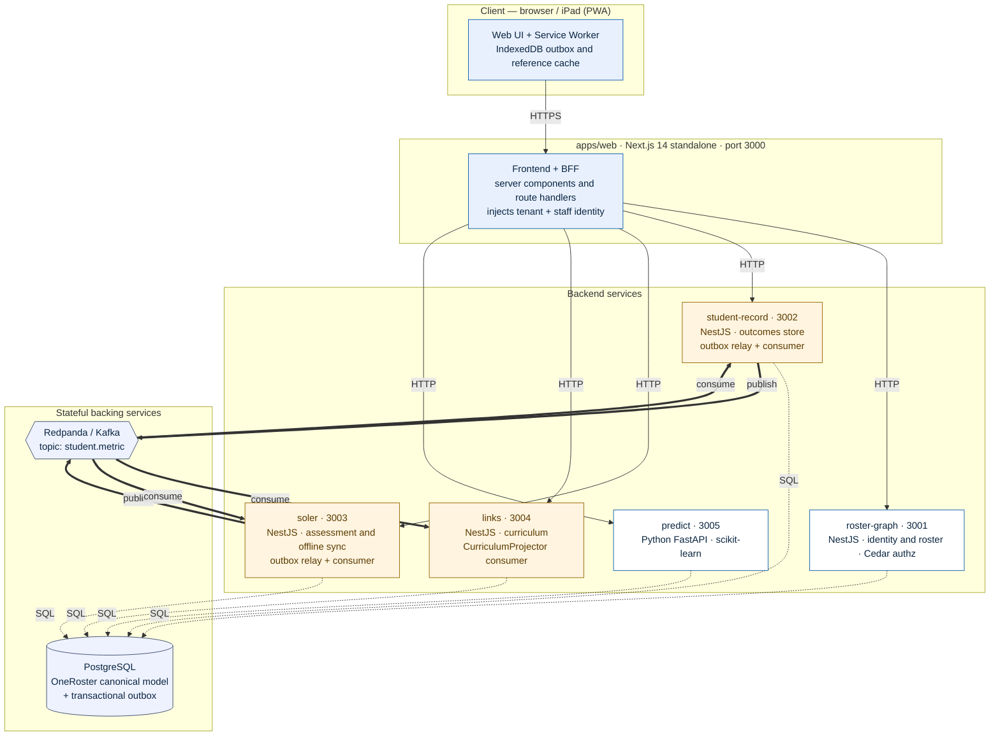
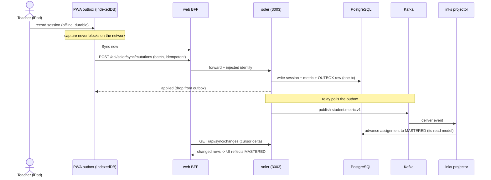
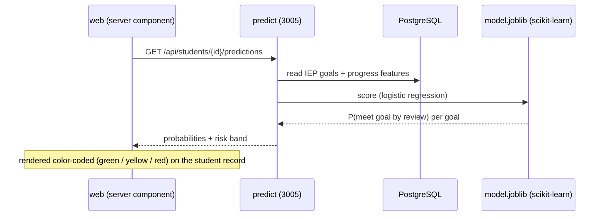

# Prototype Architecture (As Built)

**Status:** Reflects the running prototype at commit `ac986ea`. This is the
*as-built* view — what actually exists and runs — complementing the aspirational
designs in [`01-blueprint`](01-blueprint.md)–[`05-offline-sync-protocol`](05-offline-sync-protocol.md)
and the decisions in [`docs/adr/0001`](../adr/0001-microservices-ddd.md)–`0006`.

---

## 1. One-paragraph overview

STAR OnePlatform is an **8-service, event-driven system**: PostgreSQL +
Redpanda (Kafka) + a Next.js web/BFF + four NestJS backend services
(`roster-graph`, `student-record`, `soler`, `links`) + a Python `predict`
service. Clients talk only to the web tier; the web tier (a Backend-for-Frontend)
fans out to the services over HTTP, injecting the caller's identity server-side.
Services never reach into one another's data — they collaborate **asynchronously
through an event backbone**: a write is committed to a service's database *and*
to a transactional outbox in the same transaction, a relay publishes the outbox
to Kafka, and **always-on consumers** in other services react. Three services
(`soler`, `student-record`, `links`) run those always-on background workers; the
others are request/response. The predictive model is a first-class polyglot
service that scores live against the shared data spine.

---

## 2. Container diagram

**Legend** — solid arrow = synchronous HTTP; dotted = SQL read/write (incl. the
outbox table); thick arrow = asynchronous event over Kafka. Amber nodes run
**always-on background workers** (relay and/or consumer); white nodes are
request/response.

---

## 3. Components

| Component | Tech / port | Responsibility | Owns / reads | Always-on worker? |
| --- | --- | --- | --- | --- |
| **apps/web** | Next.js 14 (standalone) · 3000 | Frontend + **BFF**: serves the PWA, hosts route handlers and server components, and injects verified tenant/staff identity into every downstream call | none (stateless) | no |
| **roster-graph** | NestJS · 3001 | Identity & roster read API; `/me`, `/licenses`, admin onboarding; the **Cedar authorization** guard | reads roster/identity in Postgres | no |
| **student-record** | NestJS · 3002 | Append-only **outcomes/metric store**; writes through the transactional outbox | outcomes; produces & consumes events | **yes** (relay + consumer) |
| **soler** | NestJS · 3003 | **Assessment** — trial-by-trial sessions; `/sync/mutations` (push) and `/sync/changes` (cursor delta pull); emits `student.metric.v1` on finalize | sessions/trials; produces & consumes | **yes** (relay + consumer) |
| **links** | NestJS · 3004 | **Curriculum** — scope/sequence, lessons, assignments; the **CurriculumProjector** advances assignments when outcomes arrive | curriculum; consumes events | **yes** (consumer/projector) |
| **predict** | Python FastAPI · 3005 | Serves the **scikit-learn** goal-attainment model; per-student, caseload, and tenant roll-up scoring | reads goals/progress in Postgres | no |
| **PostgreSQL** | postgres:16 | System of record — the OneRoster canonical model + each service's tables + the outbox | — | — |
| **Redpanda** | Kafka-compatible | The **event backbone**; topic `student.metric` (from event type `student.metric.v1`) | — | — |

Shared workspace packages: **`@oneplatform/events`** (broker, envelope,
transactional-outbox helpers), **`@oneplatform/authz`** (Cedar policy + `can()`),
**`@oneplatform/database`** (Prisma schema, migrations, seed).

---

## 4. The two interaction styles

### 4.1 Synchronous — request/response through the BFF
The browser only ever calls the web origin. The web tier is a **Backend-for-
Frontend**: server components and `/api/*` route handlers call the services over
HTTP and **inject `x-tenant-id` + `x-user-id` server-side from the session** —
never trusted from the client. Each service re-derives authorization from those
headers via the **Cedar** guard (`@oneplatform/authz`), reading the roster slice
it needs. This keeps identity in one place and authorization as *policy* rather
than scattered conditionals.

### 4.2 Asynchronous — the event backbone (the heart of the design)
Cross-service collaboration never uses shared tables or direct service-to-service
calls. Instead (ADR-0003 / ADR-0004):

1. A service commits its domain write **and** an `outbox` row in **one database
   transaction** (no dual-write).
2. An **outbox relay** (a polling background loop) reads pending outbox rows and
   publishes them to Kafka, marking them published — at-least-once delivery.
3. **Idempotent consumers** in other services react and update their own
   **CQRS read models**.

This is why the system is *not* serverless-friendly: the relays and consumers
must run **continuously**, independent of inbound HTTP traffic.

---

## 5. Key flow A — the offline teacher loop (validated end-to-end)

A teacher records data with no network; it lands in an on-device IndexedDB outbox
immediately. On sync, the batch is pushed to `soler`, which writes the outcome
and an outbox row atomically; the relay publishes `student.metric.v1`; the
`links` projector consumes it and advances the curriculum assignment — **a
separate service, reacting through events, with no shared database**. A cursor
delta-pull then refreshes the device's reference cache.

## 6. Key flow B — the predictive model

`predict` is a dedicated **Python** service (polyglot — ADR-0006). It loads a
logistic-regression model trained on the platform's outcome history, reads each
goal's live features (current accuracy, weekly trend, prompt-level change,
progress-session streak) from the data spine, and returns a probability banded
into On Track (≥ 0.75), Monitor (0.50–0.74), and At Risk (< 0.50). It is
**decision support** — surfaced to teacher and leadership — not an automated
action.

---

## 7. Data & the canonical model
PostgreSQL holds the **OneRoster canonical model** (ADR-0002): tenants, orgs,
users, classes, and **many-to-many enrollments** (co-teachers and related-service
specialists), plus each service's domain tables and the shared `outbox`. Every
row carries `tenant_id`; Row-Level Security (`prisma/rls.sql`) is defined to
enforce tenant isolation defensively. In the prototype these schemas are
**co-located in one database** for a single-command demo; the production design
is **database-per-service** (ADR-0004), reached by splitting along the boundaries
already drawn here.

---

## 8. Dev vs. production topology

| Concern | Prototype (as built) | Production design |
| --- | --- | --- |
| Database | one Postgres, co-located schemas | Aurora, **database per service**, multi-AZ + replicas |
| Event broker | Redpanda (single node), or in-memory in tests | Amazon MSK + Schema Registry + DLQ |
| Outbox relay | single-instance poller | HA relay (`SELECT … FOR UPDATE SKIP LOCKED`) or Debezium CDC |
| Identity | demo session cookie + injected headers | Cognito + Clever/ClassLink/SAML/LTI + MFA |
| Deploy | `docker compose` on a persistent host (Coolify/VPS) | EKS + MSK + Aurora (ADR-aligned) |
| Web | Next.js standalone container | same, behind ALB + CloudFront |

The deployment artifacts that realize the left column live in
[`infra/docker/`](../../infra/docker/) (one parameterized `Dockerfile.nest` for
the NestJS services, a Python `Dockerfile` for `predict`, a standalone
`Dockerfile.web`, a one-shot migrate/seed, and `docker-compose.prod.yml`), with
the step-by-step in [`docs/deploy/coolify-playbook.md`](../deploy/coolify-playbook.md).

---

## 9. Cross-cutting concerns

- **Authorization** — Cedar policies (`@oneplatform/authz`), enforced per service
  off the injected identity. Policy, not scattered code (ADR-0005).
- **Offline-first** — IndexedDB outbox (push) + cursor delta-sync (pull); the
  service worker caches the app shell. See `05-offline-sync-protocol.md`.
- **Event hygiene** — versioned event types (`*.v1`), topic = type with the
  version stripped so consumers tolerate minor changes; idempotent handlers;
  at-least-once delivery (verified: events survive a consumer restart).
- **Polyglot boundaries** — Node/NestJS for the transactional services, Python
  for ML (ADR-0006).

## 10. What is prototype vs. production-grade (honest boundaries)
Working and validated: the event-driven teacher loop, offline-first sync, the
predictive model integration, and the containerized full-stack deploy. **Not yet
production-grade** (see the Production Readiness assessment): real IAM/SSO
(today's auth is a demo cookie), the database-per-service split, a single broker
node, observability (APM/tracing/alerting), and the FERPA/security hardening
student data requires. The architecture above is deliberately drawn so those are
*substitutions at the boundaries* — not rewrites.
